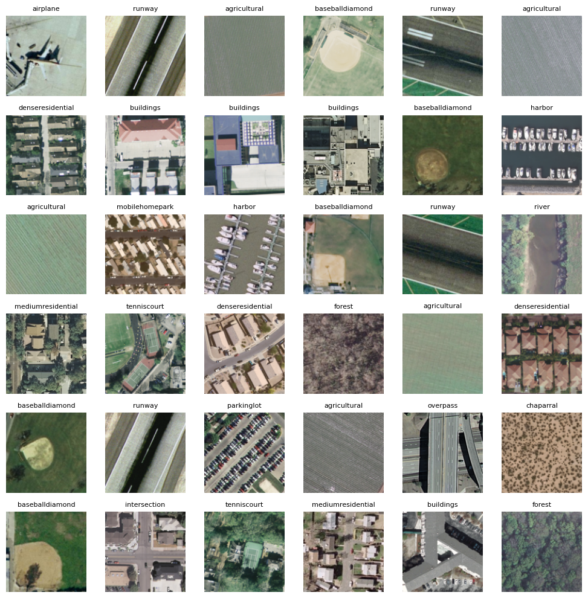
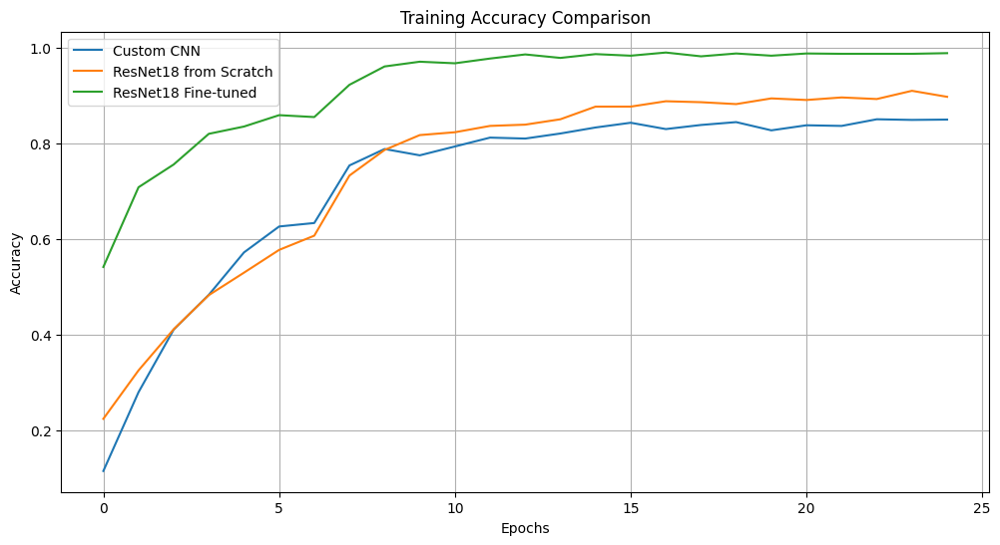
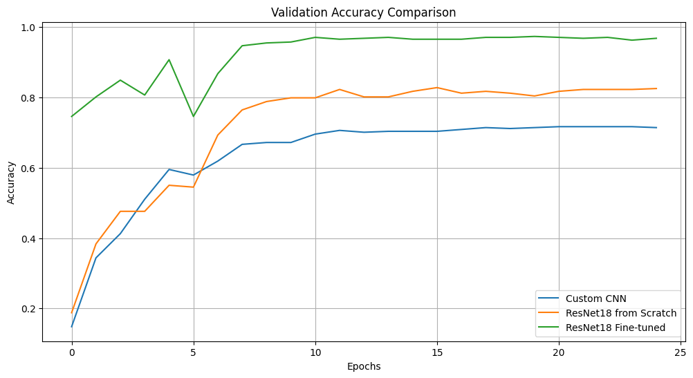
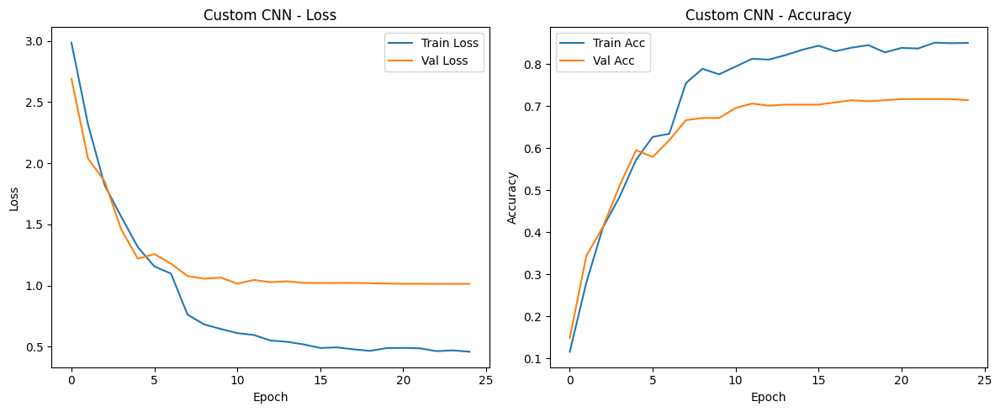
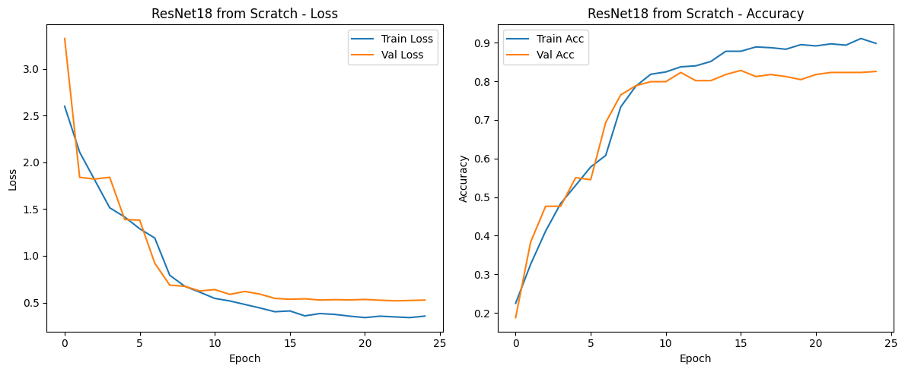
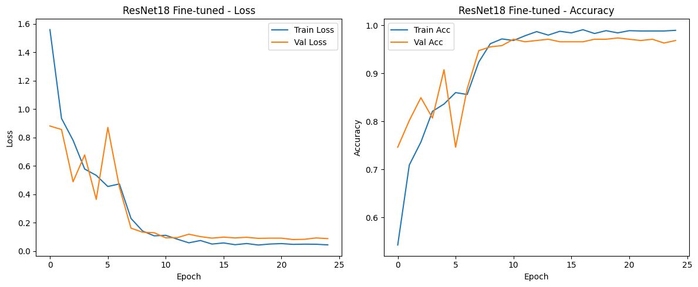
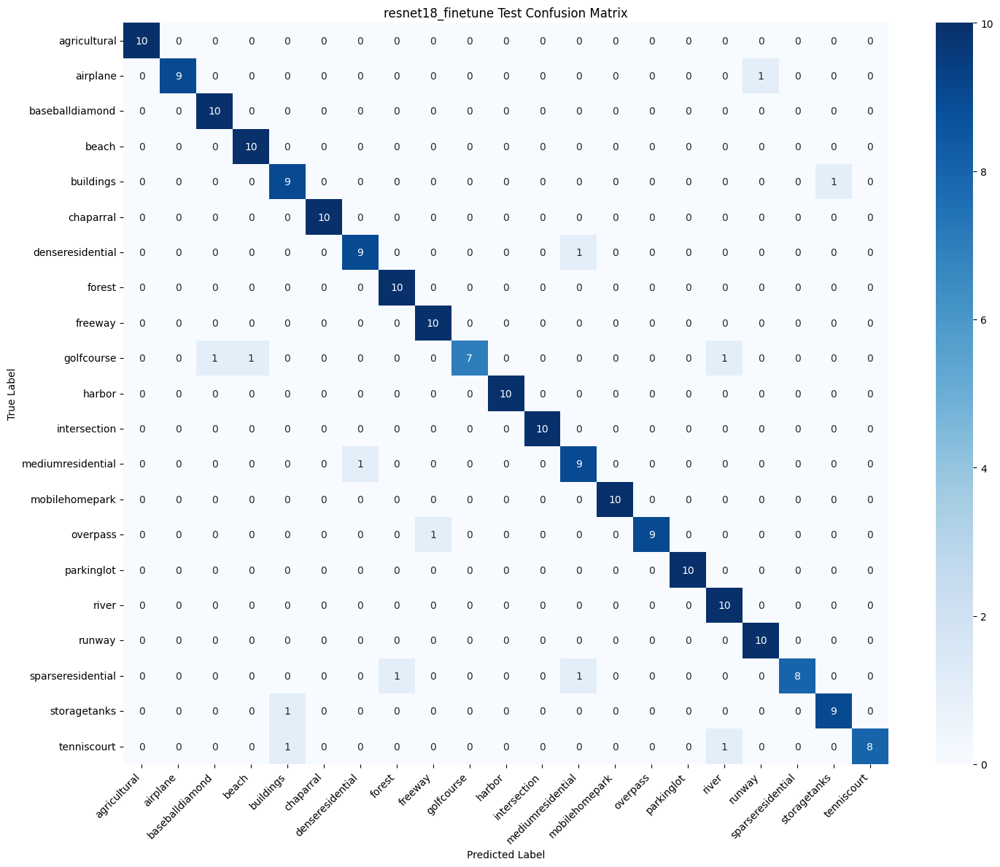

# geoScan-intelligence

A comprehensive comparison of custom CNN architectures and transfer learning approaches for multi-class aerial image classification.


## Project Overview

This project implements and compares different deep learning approaches for classifying aerial images into multiple distinct land-use categories. The work demonstrates expertise in computer vision, neural network design, and transfer learning techniques.

**Key Achievements:**
- Designed and optimized a custom CNN architecture through extensive hyperparameter tuning (128 configurations tested)
- Implemented transfer learning with ResNet-18, achieving 97.35% validation accuracy
- Conducted comprehensive model evaluation with detailed performance analysis
- Applied proper data management techniques including stratified sampling and data augmentation

## Dataset Characteristics

The aerial imagery dataset contains 2,100 high-resolution scene images (256×256 pixels) across 21 distinct land-use categories, including:
- Residential areas (various densities), Agricultural land, Transportation infrastructure, Recreational facilities, Industrial zones, Natural landscapes, and Urban structures

## Methodology

### Data Management
- **Stratified Split**: 72% training, 18% validation, 10% test
- **Preprocessing**: Resized to 128×128 pixels, normalized using ImageNet statistics
- **Data Augmentation**: Random horizontal flipping (50% probability) and rotation (±10°) for training data
- **Verification**: Ensured no data leakage between splits

### Model Architectures

#### Custom CNN Architecture
- Three convolutional blocks with progressive channel expansion (64 → 128 → 256)
- Each block: Convolution + ReLU + MaxPooling
- Classifier: Fully connected layers with 256 units and 30% dropout
- Optimized through extensive hyperparameter tuning

#### ResNet-18 Implementation
Implemented using two training strategies:
1. **Training from Scratch**: Random weight initialization
2. **Fine-tuning**: Pre-trained ImageNet weights with adaptive learning rates

### Training Configuration
- **Loss Function**: Cross-Entropy Loss
- **Optimizer**: Adam (lr=0.001, weight_decay=1e-4)
- **Scheduler**: StepLR (decay by 0.1 every 7 epochs)
- **Batch Size**: 16 (optimized)
- **Epochs**: 25

## Results

### Model Performance Comparison

| Model Strategy | Best Validation Accuracy | Final Training Accuracy | Final Training Loss |
|----------------|-------------------------|-------------------|-------------------|
| Custom CNN (Optimized) | 71.69% | 85.05% | 0.4579 |
| ResNet-18 (From Scratch) | 82.80% | 89.81% | 0.3553 |
| ResNet-18 (Fine-tuned) | **97.35%** | 98.94% | 0.0435 |

### Test Set Performance (Fine-tuned ResNet-18)
- **Test Accuracy**: 93.81%
- **Macro F1-Score**: 0.937
- **Weighted F1-Score**: 0.937

**Perfect Classification (F1-score = 1.0)**: 10 out of 21 classes
**Most Challenging Classes**: Visually similar categories (e.g., different residential densities) due to shared visual features

### Visualization and Analysis

#### Dataset Overview

*Sample images from the 21 land-use categories showing the diversity of aerial scenes in the dataset*

#### Training Progress Comparison

*Training accuracy progression across all three model strategies over 25 epochs*


*Validation accuracy comparison showing the superior performance of fine-tuned ResNet-18*

#### Individual Model Training Curves
**Custom CNN Training:**

*Training and validation metrics for the optimized custom CNN architecture*

**ResNet-18 from Scratch:**

*Training progression for ResNet-18 initialized with random weights*

**ResNet-18 Fine-tuned:**

*Training curves for fine-tuned ResNet-18 showing rapid convergence and minimal overfitting*

#### Model Performance Analysis

*Confusion matrix for the fine-tuned ResNet-18 model on the test set, showing excellent classification performance across most categories*

### Key Insights
- Transfer learning significantly outperformed training from scratch
- Fine-tuned ResNet-18 showed excellent generalization with minimal overfitting
- Most classification errors occurred between visually similar categories
- Data augmentation and proper regularization were crucial for model performance
- The fine-tuned model achieved near-perfect performance on 10 out of 21 classes

## Technical Implementation

### Requirements
```
torch>=1.9.0
torchvision>=0.10.0
numpy>=1.21.0
matplotlib>=3.4.0
scikit-learn>=0.24.0
seaborn>=0.11.0
PIL>=8.3.0
tqdm>=4.62.0
```

### Project Structure
```
├── README.md
├── LICENSE
├── Requirements.txt
├── aerial_image_classification.py    # Main implementation
├── methodology.md                    # Detailed methodology documentation
├── results/
│   ├── confusion_matrices/          # Confusion matrix plots
│   ├── training_curves/             # Loss and accuracy plots
│   ├── classification_reports/      # Detailed performance metrics
│   └── sample_images/               # Dataset visualization
```

## Key Features

- **Comprehensive Model Comparison**: Multiple architectures and training strategies
- **Robust Data Management**: Stratified sampling, proper validation splits, data augmentation
- **Hyperparameter Optimization**: Systematic tuning of network architecture and training parameters
- **Detailed Analysis**: Confusion matrices, classification reports, error analysis
- **Reproducible Results**: Fixed random seeds and documented methodology
- **Extensive Visualization**: Comprehensive plots for training progress and model performance

## Performance Highlights

The fine-tuned ResNet-18 model demonstrates:
- **High Accuracy**: 97.35% validation, 93.81% test accuracy
- **Balanced Performance**: Consistent results across all 21 classes
- **Practical Applicability**: Suitable for real-world remote sensing applications
- **Efficient Training**: Convergence within 25 epochs
- **Robust Generalization**: Minimal overfitting despite complex dataset

## Applications

This work has practical applications in:
- **Urban Planning**: Automated land-use mapping and monitoring
- **Environmental Monitoring**: Tracking land-use changes over time
- **Geographic Information Systems**: Automated classification for GIS applications
- **Remote Sensing**: Large-scale aerial image analysis
- **Infrastructure Development**: Monitoring construction and development patterns
- **Agricultural Management**: Crop type classification and land use monitoring

## Technical Skills Demonstrated

- Deep Learning architecture design and optimization
- Transfer Learning and Fine-tuning techniques
- Computer Vision and Image Classification
- Data preprocessing and augmentation strategies
- Model evaluation and performance analysis
- PyTorch implementation and GPU utilization
- Statistical analysis and visualization
- Hyperparameter tuning and experimental design
- Results interpretation and visualization

## Conclusion

This project demonstrates the significant advantages of transfer learning for aerial image classification tasks. The fine-tuned ResNet-18 model achieved exceptional performance (97.35% validation accuracy), substantially outperforming both custom CNN architectures and training from scratch. The comprehensive analysis provides valuable insights into model behavior, training dynamics, and classification challenges in multi-class aerial imagery scenarios.

The methodology and results presented here serve as a robust foundation for real-world remote sensing applications and future research in geospatial intelligence.


---

<br>

<h2 align="center">✨ Author</h2>

<p align="center">
  <b>Saad Abdur Razzaq</b><br>
  <i>Machine Learning Engineer | Effixly AI</i>
</p>

<p align="center">
  <a href="https://www.linkedin.com/in/saadarazzaq" target="_blank">
    
  </a>
  <a href="mailto:sabdurrazzaq124@gmail.com">
    
  </a>
  <a href="https://saadarazzaq.dev" target="_blank">
    
  </a>
  <a href="https://github.com/saadabdurrazzaq" target="_blank">
    
  </a>
</p>

<br>

---

<div align="center">

### ⭐ Don't forget to star this repository if you find it helpful!

</div>
